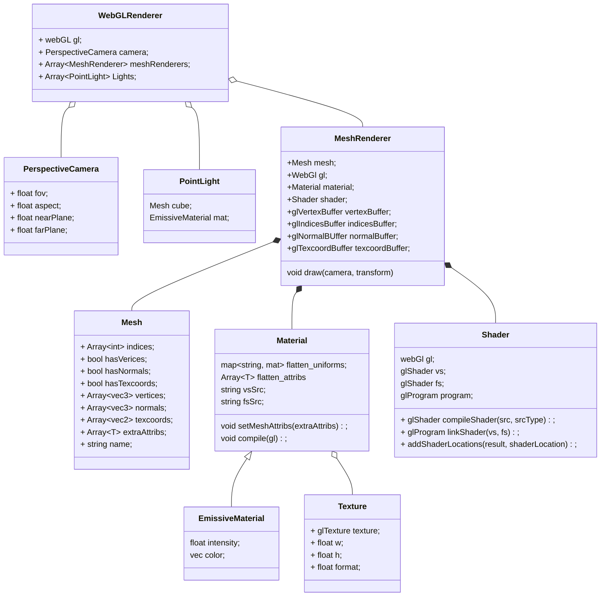

# Games202

#### 框架详解

类图



流程

```javascript
function GAMES202Main()
{
    // Canvas获取WebGL的Context
    // Camera设置
    
    //PointLight创建
    //创建PointLight的MeshRender
    //WebGLRenderer.AddLight(PointLight)
    
    loadObj()
    {
        //加载Mesh
        
        // 格式
        // 属性名：属性值
        // { name: 'aVertexPosition', array: geo.attributes.position.array }
        // { name: 'aNormalPosition', array: geo.attributes.normal.array }
        // { name: 'aTextureCoord', array: geo.attributes.uv.array }
        // indices
        
        
        // 创建Texture
       	// colorMap
        
        //创建Material
        
        // uniforms
        //属性名：{type:"", value:值}
        // 'uSampler': { type: 'texture', value: colorMap },
        // 'uTextureSample': { type: '1i', value: textureSample }
        // 'uKd': { type: '3fv', value: mat.color.toArray() }
        
        // attribs
        //[]
        
        // VertexShader, FragmentShader
        
        //创建MeshRenderer
        // gl, mesh
        // 创建各种GLBuffer
        // 编译shader
        
        // WebGLRenderer.AddMesh(MeshRenderer)
    }
    
    createGUI();
    

	function mainLoop(now) {
        // 更新相机
		cameraControls.update();

		WebGLRenderer.render(guiParams);
         {
            // clear color depth
            // 启用深度测试，方法为gl.LEQUAL
            
            // 更新点光位置，画出点光模型
            
            // 画模型
            // useProgram
            // 传值，lightPos
            meshRenderer.draw();
            {
                // 更新相机矩阵
                
                // binding vertexbuffer
                // binding normalbuffer
                // bingding texcoordsbuffer
                // bingding indicesBuffer
                
                gl.useProgram(this.shader.program.glShaderProgram);
                
                // 传入mvp
                
                //传入cameraPos
                
                //传入uniforms，包括texture
                
                gl.drawElements(gl.TRIANGLES, vertexCount, type, offset);

            }
        }
		requestAnimationFrame(mainLoop);
	}
    requestAnimationFrame(mainLoop);
}
```

Uniform的绑定

```c
const PhongVertexShader = `
attribute vec3 aVertexPosition;
attribute vec3 aNormalPosition;
attribute vec2 aTextureCoord;

uniform mat4 uModelViewMatrix;
uniform mat4 uProjectionMatrix;

varying highp vec3 vFragPos;
varying highp vec3 vNormal;
varying highp vec2 vTextureCoord;

void main(void) {

  vFragPos = aVertexPosition;
  vNormal = aNormalPosition;

  gl_Position = uProjectionMatrix * uModelViewMatrix * vec4(aVertexPosition, 1.0);

  vTextureCoord = aTextureCoord;

}
`;

const PhongFragmentShader = `
#ifdef GL_ES
precision mediump float;
#endif

uniform vec3 uKd;
uniform vec3 uKs;

uniform float uLightIntensity;

uniform int uTextureSample;
uniform sampler2D uSampler;
uniform vec3 uLightPos;
uniform vec3 uCameraPos;

varying highp vec3 vFragPos;
varying highp vec3 vNormal;
varying highp vec2 vTextureCoord;

void main(void) {
  vec3 color;

  if (uTextureSample == 1) {
    color = texture2D(uSampler, vTextureCoord).rgb;
    color = pow(color, vec3(2.2))
  } else {
    color = uKd;
  }

  vec3 l = uLightPos - vFragPos;
  float len = lenght(l);
  l = nomalize(l);
  vec3 v = normalize(uCameraPos - vFragPos);
  vec3 n = normalize(vNormal);
  vec3 h = normalize(v + l);
  
  float atten_off = uLightIntensity / len ;

  vec3 amibient = 0.05 * color;
  vec3 diffuse = color * atten_off * max(dot(n, l), 0.0);
  vec3 specular = uks * atten_off * pow(max(dot(n, h), 0.0), 35.0)

  vec3 glcolor = pow(amibient+diffuse+specular, vec3(1/2.2));

  gl_FragColor = vec4(glcolor,1);;
}
`;
```

