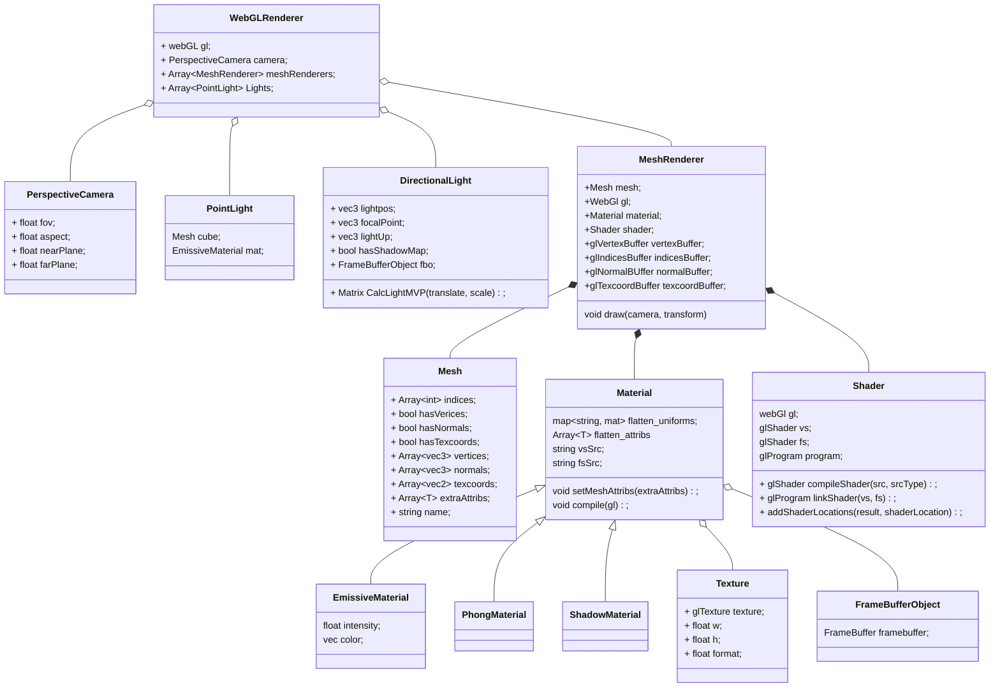

# Games202

#### 框架详解

类图



流程

```javascript
function GAMES202Main()
{
    // Canvas获取WebGL的Context
    // Camera设置
    
    //PointLight创建
    //创建PointLight的MeshRender
    //WebGLRenderer.AddLight(PointLight)
    
    loadObj()
    {
        //加载Mesh
        
        // 格式
        // 属性名：属性值
        // { name: 'aVertexPosition', array: geo.attributes.position.array }
        // { name: 'aNormalPosition', array: geo.attributes.normal.array }
        // { name: 'aTextureCoord', array: geo.attributes.uv.array }
        // indices
        
        
        // 创建Texture
       	// colorMap
        
        //创建Material
        
        // uniforms
        //属性名：{type:"", value:值}
        // 'uSampler': { type: 'texture', value: colorMap },
        // 'uTextureSample': { type: '1i', value: textureSample }
        // 'uKd': { type: '3fv', value: mat.color.toArray() }
        
        // attribs
        //[]
        
        // VertexShader, FragmentShader
        
        //创建MeshRenderer
        // gl, mesh
        // 创建各种GLBuffer
        // 编译shader
        
        // WebGLRenderer.AddMesh(MeshRenderer)
    }
    
    createGUI();
    

	function mainLoop(now) {
        // 更新相机
		cameraControls.update();

		WebGLRenderer.render(guiParams);
         {
            // clear color depth
            // 启用深度测试，方法为gl.LEQUAL
            
            // 更新点光位置，画出点光模型
            
            // 画模型
            // useProgram
            // 传值，lightPos
            meshRenderer.draw();
            {
                // 更新相机矩阵
                
                // binding vertexbuffer
                // binding normalbuffer
                // bingding texcoordsbuffer
                // bingding indicesBuffer
                
                gl.useProgram(this.shader.program.glShaderProgram);
                
                // 传入mvp
                
                //传入cameraPos
                
                //传入uniforms，包括texture
                
                gl.drawElements(gl.TRIANGLES, vertexCount, type, offset);

            }
        }
		requestAnimationFrame(mainLoop);
	}
    requestAnimationFrame(mainLoop);
}
```

#### Uniform的绑定

#### 阴影流程

```javascript
function GAMES202Main()
{
    // 添加产生阴影的光源信息
	let lightPos = [0, 80, 80];
	let focalPoint = [0, 0, 0];
	let lightUp = [0, 1, 0]
	const directionLight = new DirectionalLight(5000, [1, 1, 1], lightPos, focalPoint, lightUp, true, renderer.gl);
    {
        // 创建shadowMap的FrameBuffer，texture和renderbufffer，并将三者绑定在一起
        // 分辨率
        // renderbufffer的用途和格式gl.DEPTH_COMPONENT16
        this.fbo = new FBO(gl);
    }
    
	renderer.addLight(directionLight);
   
    function loadOBJ(renderer, path, name, objMaterial, transform)
    {
        // 创建着色材质和Shadow材质
        material = buildPhongMaterial(colorMap, mat.specular, light, Translation, Scale, "phongVertex.glsl", "phongFragment.glsl");
        {
            // 将light的FBO对象绑定到shader的uShadowMap上
            // 计算light的MVP矩阵
            // 将光源的lightMVP绑定到shader的uLightMVP
        }
        shadowMaterial = buildShadowMaterial(light, Translation, Scale, "shadowVertex.glsl", "shadowFragment.glsl");
        {
            // 计算lightMVP
            let lightMVP = light.CalcLightMVP(translate, scale);
            
            // 将light的FBO对象绑定到材质的frameBuffer上
        }
        
        //添加模型和阴影模型
        let meshRender = new MeshRender(renderer.gl, mesh, data);
        {
            // 绑定顶点信息
            // 编译shader
        }
        renderer.addMeshRender(meshRender);
        let shadowMeshRender = new MeshRender(renderer.gl, mesh, data);
        renderer.addShadowMeshRender(shadowMeshRender);
    }
    
    WebGLRenderer.render() 
    {
        // light pass
        this.shadowMeshes[i].draw(this.camera);
        {
            // 将当前渲染的Target绑定为shadowMap的frameBuffer,以便shadow渲染
            gl.bindFramebuffer(gl.FRAMEBUFFER, this.material.frameBuffer);
            gl.viewport(0.0, 0.0, resolution, resolution);
            
             this.bindMaterialParameters(); // lightMVP的binding
            
            //vertex shader
            // 使用计算出的LightMVP转换顶点的pos
            
            //透视除法到ndc，视图变换到图像空间，得到pos
            //插值得到每个fragment的pos
            
            //fragment shader
            //将每个fragment的pos pack成rgba写入到fbo中,生成shadowmap
        }
        
        // scene pass
        this.meshes[i].draw(this.camera);
        {
            this.bindMaterialParameters();
            {
                // 绑定fbo到uShadowMap上
                // 绑定lightMVP到shader变量uLightMVP上
            }
            
            // vertex shader
            // 计算出当前顶点在light空间下的投影位置vPositionFromLight
            
            // 插值得到每个fragment的vPositionFromLight
            
            // fragemt shader
            // 对shadingpoint的vPositionFromLight做透视除法和视图变换,得到视图空间下的位置和深度
            
            // 硬阴影
            // 拿位置采样shadowmap得到深度，与当前shadingpoint在light空间下的深度做对比,非0即1，0时不着色，1是着色
            // bias
            
            // pcf 阴影抗锯齿
            // 对shadingpoint对应在shadowmap上的一圈位置进行采样，每个都与hadingpoint在light空间下的深度对比，也是非0即1
            // 但是将它们的和加起来，再除以采样次数，得到一个0-1之间的数，用这个数乘以着色值，得到最后的值
            
            // pcss
            // 1.blocker search
            // 对shadingpoint在shadowmap上的一圈位置采样，每个都与hadingpoint在light空间下的深度对比，如果shadingpoint被挡住，则将
            // 此深度值累加，否则，do nothing。采样完了之后，得出遮挡物的平均深度avgDepth.
            
            // 2.计算filtersize
            // 利用三角形相似，得出公式w = wl * (dr - db) / db， w就是伴影大小，用这个大小确定filtering size
            
            // 3.再用上次计算得到的filtersize做一次pcf即可得到软阴影
        }
    }
}
```

#### 问题

1. 采样shadowMap的纹理坐标的计算

   阴影贴图是在light空间下渲染的，所以相机空间下看到的shadingPoint需要转换到light空间下，这样才能在shadowmap上采样出正确的深度。其次采样的uv坐标也应该是shadowMap空间的uv坐标。shadingPoint的位置乘以lightMVP之后，将其转换到了裁剪空间下，还需要进行到NDC坐标的转换，首先得做透视除法，转换到了NDC空间下，也即坐标范围到了-1.0~1.0，必须要再做一次转换将其映射到0-1，适应纹理坐标是0-1之间的要求
   
2. filtering size的计算要用到卷积计算，需要学习。

#### PCF

均匀圆盘采样
圆的面积为$\pi*r^2$, 圆环的面积为$\pi*(r_1^2 - r_2^2)$ ,在增加$\Delta r$时，极限情况下，圆环的面积为$\pi*((r+\Delta r)^2 - r^2)$ ,即是周长$2\pi r$，极坐标下，在角度均匀随机的情况下，同样的$\Delta r$会因为r的大小不同而导致面积不同，面积越大，采样的概率越大，所以概率密度就不均匀了。那么对r的均匀采样应该与面积线性相关，也就是对$r^2$进行均匀采样。

```c++
void uniformDiskSamples( const in vec2 randomSeed ) {

  float randNum = rand_2to1(randomSeed);
  float sampleX = rand_1to1( randNum ) ;
  float sampleY = rand_1to1( sampleX ) ;

  float angle = sampleX * PI2;
  float radius = sqrt(sampleY);

  for( int i = 0; i < NUM_SAMPLES; i ++ ) {
    poissonDisk[i] = vec2( radius * cos(angle) , radius * sin(angle)  );

    sampleX = rand_1to1( sampleY ) ;
    sampleY = rand_1to1( sampleX ) ;

    angle = sampleX * PI2;
    radius = sqrt(sampleY);
  }
}
```

泊松圆盘采样

```c#
    public static List<Vector2> GeneratePoint(float radius, Vector2 regionSize, int numRejectionSmaple = 30)
    {
        float cellSize = radius / Mathf.Sqrt(2f);
        int cellNumX = Mathf.CeilToInt(regionSize.x / cellSize);
        int cellNumY = Mathf.CeilToInt(regionSize.y / cellSize);

        int[,] grid = new int[cellNumX, cellNumY];
        List<Vector2> points = new List<Vector2>();
        List<Vector2> samplePoints = new List<Vector2>();
        samplePoints.Add(regionSize / 2f);

        while(samplePoints.Count>0)
        {
            int spawnIndex = Random.Range(0, samplePoints.Count);
            Vector2 spawnCenter = samplePoints[spawnIndex];
            bool candidateAccepted = false;
            for (int i = 0; i < numRejectionSmaple; i ++)
            {
                float angle = Random.value * Mathf.PI * 2f;
                Vector2 dir = new Vector2(Mathf.Cos(angle), Mathf.Sin(angle));
                Vector2 candidate = spawnCenter + dir * Random.Range(radius, 2f * radius);
                if(IsValidate(candidate, regionSize, radius, cellSize, ref grid, ref points))
                {
                    points.Add(candidate);
                    samplePoints.Add(candidate);
                    grid[(int)(candidate.x / cellSize), (int)(candidate.y / cellSize)] = points.Count;
                    candidateAccepted = true;
                    break;
                }
            }

            if(!candidateAccepted)
            {
                samplePoints.RemoveAt(spawnIndex);
            }
        }

        return points;
    }

    private static bool IsValidate(Vector2 candidate, Vector2 regionSize, float radius, float cellSize, ref int[,] grid, ref List<Vector2> points)
    {
        if(candidate.x >= 0f && candidate.x <= regionSize.x && candidate.y >= 0f && candidate.y <= regionSize.y)
        {
            int cellX = (int)(candidate.x / cellSize);
            int cellY = (int)(candidate.y / cellSize);
            int startCellX = Mathf.Max(0, cellX - 2);
            int endCellX = Mathf.Min(cellX + 2, grid.GetLength(0) - 1);

            int startCellY = Mathf.Max(0, cellY - 2);
            int endCellY = Mathf.Min(cellY + 2, grid.GetLength(1) - 1);

            for(int x = startCellX; x <= endCellX; x ++)
            {
                for(int y = startCellY; y <= endCellY; y ++)
                {
                    int index = grid[x, y] - 1;
                    if(index != -1)
                    {
                        float dist = (points[index] - candidate).sqrMagnitude;
                        if (dist < radius * radius)
                            return false;
                    }
                }
            }

            return true;
        }

        return false;
    }
```

