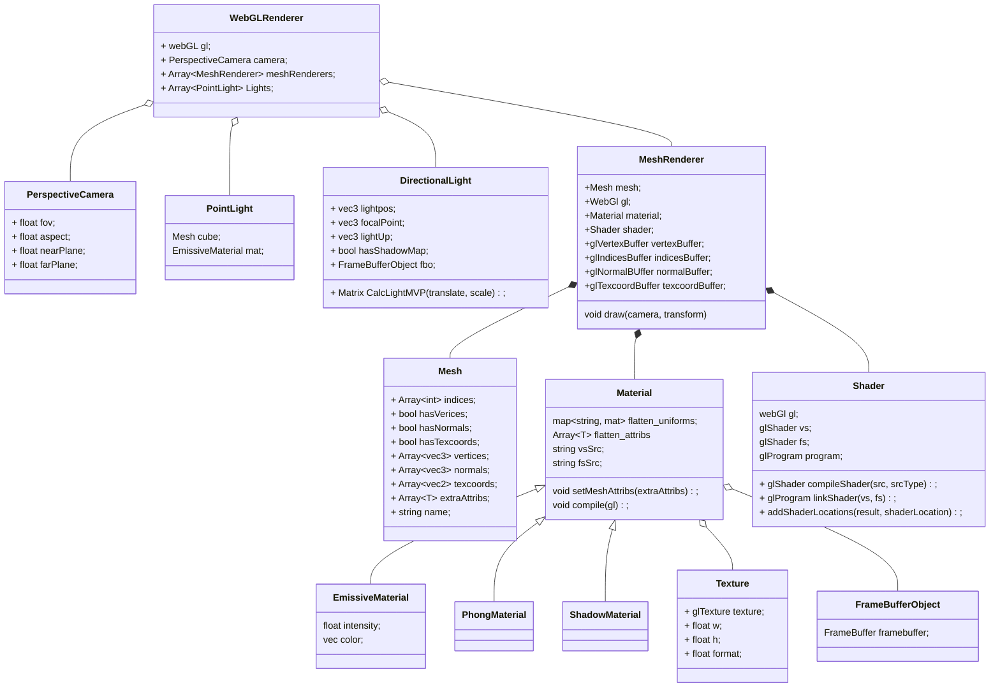

# Games202

#### 框架详解

类图



流程

```javascript
function GAMES202Main()
{
    // Canvas获取WebGL的Context
    // Camera设置
    
    //PointLight创建
    //创建PointLight的MeshRender
    //WebGLRenderer.AddLight(PointLight)
    
    loadObj()
    {
        //加载Mesh
        
        // 格式
        // 属性名：属性值
        // { name: 'aVertexPosition', array: geo.attributes.position.array }
        // { name: 'aNormalPosition', array: geo.attributes.normal.array }
        // { name: 'aTextureCoord', array: geo.attributes.uv.array }
        // indices
        
        
        // 创建Texture
       	// colorMap
        
        //创建Material
        
        // uniforms
        //属性名：{type:"", value:值}
        // 'uSampler': { type: 'texture', value: colorMap },
        // 'uTextureSample': { type: '1i', value: textureSample }
        // 'uKd': { type: '3fv', value: mat.color.toArray() }
        
        // attribs
        //[]
        
        // VertexShader, FragmentShader
        
        //创建MeshRenderer
        // gl, mesh
        // 创建各种GLBuffer
        // 编译shader
        
        // WebGLRenderer.AddMesh(MeshRenderer)
    }
    
    createGUI();
    

	function mainLoop(now) {
        // 更新相机
		cameraControls.update();

		WebGLRenderer.render(guiParams);
         {
            // clear color depth
            // 启用深度测试，方法为gl.LEQUAL
            
            // 更新点光位置，画出点光模型
            
            // 画模型
            // useProgram
            // 传值，lightPos
            meshRenderer.draw();
            {
                // 更新相机矩阵
                
                // binding vertexbuffer
                // binding normalbuffer
                // bingding texcoordsbuffer
                // bingding indicesBuffer
                
                gl.useProgram(this.shader.program.glShaderProgram);
                
                // 传入mvp
                
                //传入cameraPos
                
                //传入uniforms，包括texture
                
                gl.drawElements(gl.TRIANGLES, vertexCount, type, offset);

            }
        }
		requestAnimationFrame(mainLoop);
	}
    requestAnimationFrame(mainLoop);
}
```

#### Attribute绑定流程

1. 以key形式在xxxMaterial的构造函数中声明，这一步将Attribute变量添加到了Material的attribs数组中

   ```javascript
           super({
               // Phong
               'uPrecomputeL[0]': { type: 'precomputeL', value: null},
               'uPrecomputeL[1]': { type: 'precomputeL', value: null},
               'uPrecomputeL[2]': { type: 'precomputeL', value: null},
   
           }, ['aPrecomputeLT'], vertexShader, fragmentShader, null);
   ```

2. 在meshRender中使用API将顶点属性传入到shader中

   ```javascript
   		if (this.mesh.hasNormals) {
   			const numComponents = 3;
   			const type = gl.FLOAT;
   			const normalize = false;
   			const stride = 0;
   			const offset = 0;
   			gl.bindBuffer(gl.ARRAY_BUFFER, this.#normalBuffer);
   			gl.vertexAttribPointer(
   				this.shader.program.attribs[this.mesh.normalsName],
   				numComponents,
   				type,
   				normalize,
   				stride,
   				offset);
   			gl.enableVertexAttribArray(
   				this.shader.program.attribs[this.mesh.normalsName]);
   		}
   ```

#### Uniform的绑定

1. 以key-value形式在xxxMaterial的构造函数中声明，这一步将uniform变量添加到了Material的uniforms字典中

   ```javascript
   //例
   // type为了区分，调用合适的api传入到gpu中
   'uSampler': { type: 'texture', value: color }
   ```

2. 在meshRender中遍历Material的uniforms字典，根据type，将变量和变量名绑定起来传入到GPU Shader中

   ```javascript
   		let textureNum = 0;
   		for (let k in this.material.uniforms) {
   
   			if (this.material.uniforms[k].type == 'matrix4fv') {
   				gl.uniformMatrix4fv(
   					this.shader.program.uniforms[k],
   					false,
   					this.material.uniforms[k].value);
   			} else if (this.material.uniforms[k].type == 'matrix3fv') {
   				gl.uniformMatrix3fv(
   					this.shader.program.uniforms[k],
   					false,
   					this.material.uniforms[k].value);
   			} else if (this.material.uniforms[k].type == '3fv') {
   				gl.uniform3fv(
   					this.shader.program.uniforms[k],
   					this.material.uniforms[k].value);
   			} else if (this.material.uniforms[k].type == '1f') {
   				gl.uniform1f(
   					this.shader.program.uniforms[k],
   					this.material.uniforms[k].value);
   			} else if (this.material.uniforms[k].type == '1i') {
   				gl.uniform1i(
   					this.shader.program.uniforms[k],
   					this.material.uniforms[k].value);
   			} else if (this.material.uniforms[k].type == 'texture') {
   				gl.activeTexture(gl.TEXTURE0 + textureNum);
   				gl.bindTexture(gl.TEXTURE_2D, this.material.uniforms[k].value.texture);
   				gl.uniform1i(this.shader.program.uniforms[k], textureNum);
   				textureNum += 1;
   			} else if (this.material.uniforms[k].type == 'CubeTexture') {
   				gl.activeTexture(gl.TEXTURE0 + textureNum);
   				//console.log(cubeMap.texture)
   				gl.bindTexture(gl.TEXTURE_CUBE_MAP, cubeMaps[guiParams.envmapId].texture);
   				gl.uniform1i(this.shader.program.uniforms[k], textureNum);
   				textureNum += 1;
   			}
   		}
   ```

   
