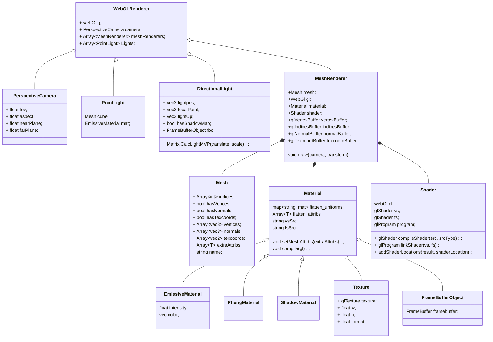

# Games202

#### 框架详解

类图



流程

```javascript
function GAMES202Main()
{
    // Canvas获取WebGL的Context
    // Camera设置
    
    //PointLight创建
    //创建PointLight的MeshRender
    //WebGLRenderer.AddLight(PointLight)
    
    loadObj()
    {
        //加载Mesh
        
        // 格式
        // 属性名：属性值
        // { name: 'aVertexPosition', array: geo.attributes.position.array }
        // { name: 'aNormalPosition', array: geo.attributes.normal.array }
        // { name: 'aTextureCoord', array: geo.attributes.uv.array }
        // indices
        
        
        // 创建Texture
       	// colorMap
        
        //创建Material
        
        // uniforms
        //属性名：{type:"", value:值}
        // 'uSampler': { type: 'texture', value: colorMap },
        // 'uTextureSample': { type: '1i', value: textureSample }
        // 'uKd': { type: '3fv', value: mat.color.toArray() }
        
        // attribs
        //[]
        
        // VertexShader, FragmentShader
        
        //创建MeshRenderer
        // gl, mesh
        // 创建各种GLBuffer
        // 编译shader
        
        // WebGLRenderer.AddMesh(MeshRenderer)
    }
    
    createGUI();
    

	function mainLoop(now) {
        // 更新相机
		cameraControls.update();

		WebGLRenderer.render(guiParams);
         {
            // clear color depth
            // 启用深度测试，方法为gl.LEQUAL
            
            // 更新点光位置，画出点光模型
            
            // 画模型
            // useProgram
            // 传值，lightPos
            meshRenderer.draw();
            {
                // 更新相机矩阵
                
                // binding vertexbuffer
                // binding normalbuffer
                // bingding texcoordsbuffer
                // bingding indicesBuffer
                
                gl.useProgram(this.shader.program.glShaderProgram);
                
                // 传入mvp
                
                //传入cameraPos
                
                //传入uniforms，包括texture
                
                gl.drawElements(gl.TRIANGLES, vertexCount, type, offset);

            }
        }
		requestAnimationFrame(mainLoop);
	}
    requestAnimationFrame(mainLoop);
}
```

### 作业3

**`WEBGL_draw_buffers`** 扩招，允许shader同时给N张Texture写入着色信息

`FBO` 缓冲区对象，可以包含N个glTexture对象，和N个glAttachment对象，以及一个depthbuffer

`Texture` 贴图对象，用来创建模型的各种贴图资源，包含创建mipmap功能

#### 加载

除了加载模型之外，还添加了创建模型diffuseMap、specularMap，以及normalMap的功能。材质方面，添加了三种材质，分别是ShadowMaterial，GbufferMaterial，SSRMaterial，添加了对应以上材质的三种mesh，也就是三次pass。

#### 渲染

##### `ShadowPass` 生成shadowMap

##### `GbufferPass`

输入：diffuseMap、normalMap、以及shadowMap和uLightVP。

`vertexShader`输出： 世界空间下的，顶点坐标，顶点法线，深度值，各个顶点的uv坐标，LightVP

`fragmentShader`

Gbuffer 0：diffuse

Gbuffer 1：深度值

？Gbuffer 2：采样深度贴图，转换到世界空间的法线值

？Gbuffer 3：判断阴影贴图上记录的深度是否比当前fragment的深度小，是记录0，否记录1

Gbuffer 4：世界空间的坐标

##### `SSR Pass`

输入：五个gBuffer，光照方向，光照强度

`vertexShader`:世界空间下的位置，以及cameraVP

`fragmentShader`

------


1. 光线起点是什么？光线方向又是什么？

   光线起点是GBuffer中的每个值，也就是屏幕上每个像素的世界空间下的坐标值

   光线的方向是，起点到相机的方向在起点的法线上的反射方向

2. 步进距离？

   当前我们只有一张深度图，没有记录最小深度的mipMap，是否需要生成？

3. 相交如何判断？如何求交点？

   步进之后会得到一个点，可以拿这个点的深度与深度图中的值作判断，如果大于，就是相交了，步进得小一点，那么如何判断相交呢？

------

### Hi-z

1. 
